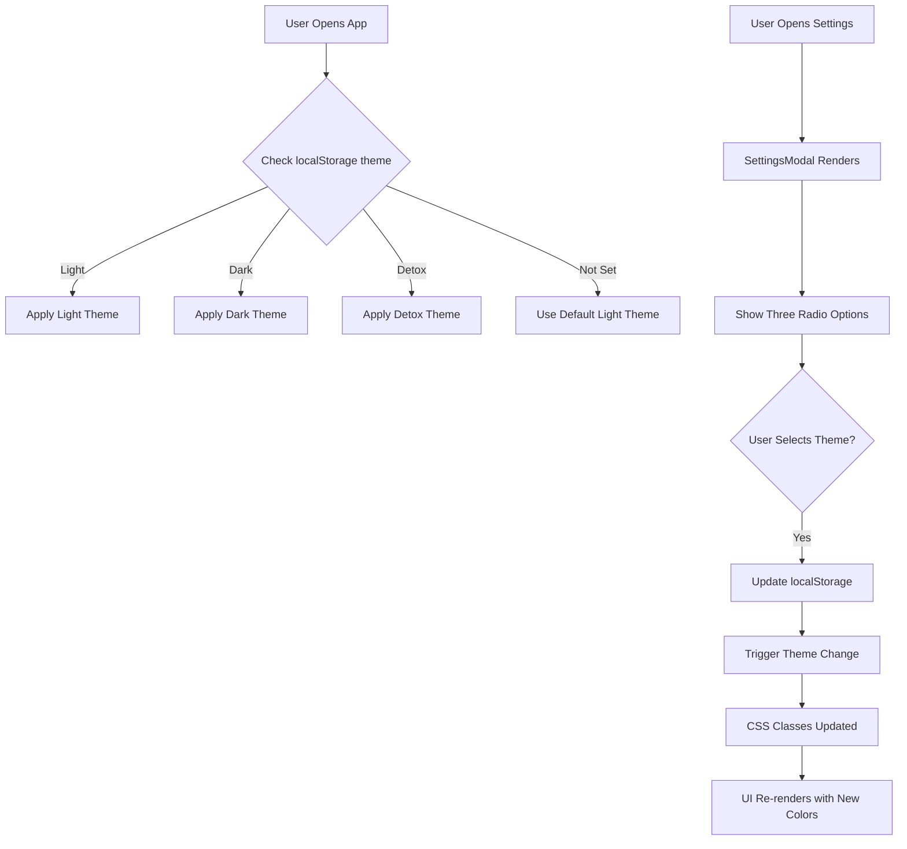

# TRD-003: Detox Theme Implementation

**Status**: 📝 Draft  
**Priority**: Medium  
**Related PRD**: [PRD-003: Detox Theme Mode](../prd/PRD-003-detox-theme.md)  
**Created**: January 5, 2026  
**Last Updated**: January 5, 2026  
**Implemented By**: TBD

---

## Overview

This TRD defines the technical implementation for adding a "Detox" theme to the application. The Detox theme uses minimal, monochromatic colors (white, grays, and black) to reduce visual stimulation and improve focus. The implementation leverages Tailwind CSS utility classes and extends the existing theme configuration system to support three themes: Light, Dark, and Detox.

---

## Related PRD

- [PRD-003: Detox Theme Mode](../prd/PRD-003-detox-theme.md)

---

## Technical Architecture

### System Flow



### Component Architecture

```
config/theme.ts (UPDATED)
    ├── lightTheme object
    ├── darkTheme object
    └── detoxTheme object (NEW)

hooks/useSettings.ts
    ├── Read theme from localStorage
    ├── Update theme setting
    └── Trigger re-render

components/SettingsModal.tsx
    ├── Add Detox radio option
    ├── Three theme choices
    └── onChange handler for theme update

app/layout.tsx
    ├── Apply theme CSS classes
    └── Listen to theme changes

app/page.tsx & app/reader/[id]/page.tsx
    ├── Use theme classes via config
    └── Support Detox styling
```

---

## Data Models

### Updated Settings Type

```typescript
// types/index.ts
export type Settings = {
  theme: 'light' | 'dark' | 'detox';
  fontSize: 'sm' | 'md' | 'lg';
  lineHeight: 'normal' | 'relaxed' | 'loose';
};
```

### Theme Configuration Structure

```typescript
// config/theme.ts
export const themes = {
  light: {
    background: {
      page: 'bg-yellow-50',
      card: 'bg-lime-50',
      hover: 'bg-lime-100',
    },
    text: {
      primary: 'text-gray-900',
      secondary: 'text-gray-600',
    },
    border: 'border-emerald-200',
    accent: 'bg-gradient-to-r from-yellow-300 to-emerald-400',
    button: {
      primary: 'bg-emerald-500 hover:bg-emerald-600',
      secondary: 'bg-lime-200 hover:bg-lime-300',
    },
  },
  dark: {
    background: {
      page: 'bg-gray-950',
      card: 'bg-gray-900',
      hover: 'bg-gray-800',
    },
    text: {
      primary: 'text-white',
      secondary: 'text-gray-400',
    },
    border: 'border-purple-900',
    accent: 'bg-gradient-to-r from-purple-600 to-gray-700',
    button: {
      primary: 'bg-purple-600 hover:bg-purple-700',
      secondary: 'bg-gray-800 hover:bg-gray-700',
    },
  },
  detox: {
    background: {
      page: 'bg-white',
      card: 'bg-gray-50',
      hover: 'bg-gray-100',
    },
    text: {
      primary: 'text-gray-900',
      secondary: 'text-gray-500',
      tertiary: 'text-gray-400',
    },
    border: 'border-gray-200',
    accent: 'bg-gray-700',
    button: {
      primary: 'bg-gray-800 text-white hover:bg-gray-900',
      secondary: 'bg-gray-200 text-gray-800 hover:bg-gray-300',
    },
    progressBar: {
      background: 'bg-gray-200',
      fill: 'bg-gray-800',
    },
  },
};
```

### localStorage Schema

```typescript
// Existing structure (updated)
{
  "readings": Reading[],
  "settings": {
    "theme": "light" | "dark" | "detox",  // Extended from light/dark only
    "fontSize": "sm" | "md" | "lg",
    "lineHeight": "normal" | "relaxed" | "loose"
  },
  "completedReadings": string[],
  "dashboardTab": "active" | "completed"
}
```

---

## Implementation Details

### 1. Update Configuration File

**File**: [config/theme.ts](../../../config/theme.ts)

Add the `detoxTheme` object with all necessary color definitions following the Tailwind CSS naming convention.

```typescript
export const detoxTheme = {
  background: {
    page: 'bg-white',
    card: 'bg-gray-50',
    hover: 'bg-gray-100',
  },
  text: {
    primary: 'text-gray-900',
    secondary: 'text-gray-500',
    tertiary: 'text-gray-400',
  },
  border: 'border-gray-200',
  accent: 'bg-gray-700',
  button: {
    primary: 'bg-gray-800 text-white hover:bg-gray-900',
    secondary: 'bg-gray-200 text-gray-800 hover:bg-gray-300',
  },
  progressBar: {
    background: 'bg-gray-200',
    fill: 'bg-gray-800',
  },
  pendingDot: 'bg-gray-700',
  tag: {
    background: 'bg-gray-200',
    text: 'text-gray-800',
    border: 'border-gray-300',
  },
};
```

### 2. Update Types

**File**: [types/index.ts](../../../types/index.ts)

Extend the `Settings` type to accept 'detox' as a valid theme option:

```typescript
export type Settings = {
  theme: 'light' | 'dark' | 'detox';
  fontSize: 'sm' | 'md' | 'lg';
  lineHeight: 'normal' | 'relaxed' | 'loose';
};
```

### 3. Update SettingsModal Component

**File**: [components/SettingsModal.tsx](../../../components/SettingsModal.tsx)

Add a third radio button option for "Detox" theme in the theme selector section:

```typescript
<fieldset className="space-y-3">
  <legend className="font-semibold">Theme</legend>
  <div className="space-y-2">
    <label className="flex items-center gap-2 cursor-pointer">
      <input
        type="radio"
        name="theme"
        value="light"
        checked={settings.theme === 'light'}
        onChange={() => handleThemeChange('light')}
      />
      Light
    </label>
    <label className="flex items-center gap-2 cursor-pointer">
      <input
        type="radio"
        name="theme"
        value="dark"
        checked={settings.theme === 'dark'}
        onChange={() => handleThemeChange('dark')}
      />
      Dark
    </label>
    <label className="flex items-center gap-2 cursor-pointer">
      <input
        type="radio"
        name="theme"
        value="detox"
        checked={settings.theme === 'detox'}
        onChange={() => handleThemeChange('detox')}
      />
      Detox
    </label>
  </div>
</fieldset>
```

### 4. Update Layout Component

**File**: [app/layout.tsx](../../../app/layout.tsx)

Update the layout to apply the correct theme classes based on the selected theme and apply them to the root HTML element or body element.

### 5. Update Component Styling

Apply theme colors to all components:

- **Header.tsx**: Update background and text colors
- **ReadingCard.tsx**: Update card background, hover states, and pending dot indicator
- **NewReadingModal.tsx**: Update modal background and button colors
- **EditTitleModal.tsx**: Update modal styling
- **ConfirmDeleteModal.tsx**: Update modal and button styling
- **CodeBlock.tsx**: Update background and syntax highlighting colors
- **globals.css**: Add base detox theme colors if needed

### 6. Pending Indicator Logic

**File**: [components/ReadingCard.tsx](../../../components/ReadingCard.tsx)

Update the pending dot indicator to use grayscale in Detox theme:

```typescript
const dotColor = {
  light: 'bg-lime-500',
  dark: 'bg-purple-500',
  detox: 'bg-gray-700',
}[settings.theme];

return <div className={`w-2 h-2 rounded-full ${dotColor}`} />;
```

### 7. Tags Styling (If Applicable)

**File**: [lib/utils/tagHelpers.ts](../../../lib/utils/tagHelpers.ts)

Update tag color assignment to support grayscale for Detox theme:

```typescript
export const getTagColor = (tag: string, theme: 'light' | 'dark' | 'detox') => {
  if (theme === 'detox') {
    return {
      background: 'bg-gray-200',
      text: 'text-gray-800',
      border: 'border-gray-300',
    };
  }
  // ... existing logic for light and dark themes
};
```

---

## Accessibility Considerations

### Contrast Ratios

- **Primary text (#111827) on white (#FFFFFF)**: 16.1:1 ✅ WCAG AAA
- **Secondary text (#6B7280) on white (#FFFFFF)**: 8.6:1 ✅ WCAG AAA
- **Button (#374151) on white (#FFFFFF)**: 10.5:1 ✅ WCAG AAA
- **Borders (#E5E7EB) on white (#FFFFFF)**: Visible, meets minimum standards

### Testing Recommendations

- Test with Stark (Figma plugin) or WAVE browser extension
- Use Color Oracle or similar color blindness simulator
- Verify keyboard navigation visibility
- Test focus states with dark background (#374151)

---

## Testing Strategy

### Unit Tests

- Verify theme configuration object structure
- Test Settings type validation
- Test theme selection logic in useSettings hook

### Integration Tests

- Verify theme persists after page reload
- Test theme switching between all three options
- Verify all components respond to theme changes
- Test localStorage update on theme change

### Manual Testing

- Test visual appearance in all three themes
- Verify all UI elements are readable
- Test on different screen sizes
- Test keyboard navigation visibility
- Test with browser zoom levels

### Accessibility Testing

- Run WAVE accessibility audit
- Test with color blindness simulators
- Verify contrast ratios
- Test keyboard navigation

---

## Migration & Backward Compatibility

- Existing users with 'light' or 'dark' theme will continue to use their selected theme
- Default theme for new users remains 'light'
- No breaking changes to existing data structures
- Settings type is backward compatible (existing settings without 'detox' will work)

---

## Performance Considerations

- Theme switching uses CSS classes only (no JavaScript color calculations)
- No additional assets required
- Minimal bundle size impact
- No layout shifts during theme transitions

---

## Future Enhancements

- Add smooth CSS transitions between theme changes
- Allow custom theme creation
- Add theme preview in settings before applying
- Support system preference detection (prefers-color-scheme)
- Add theme scheduling (auto-switch at specific times)
