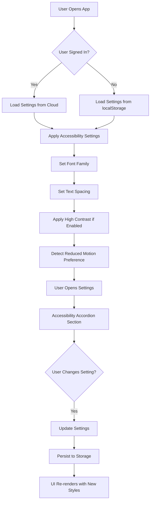

# TRD-004: Accessibility Features Implementation

**Status**: 📝 Draft  
**Priority**: High  
**Related PRD**: [PRD-004: Accessibility Features](../prd/PRD-004-accessibility.md)  
**Created**: January 5, 2026  
**Last Updated**: January 5, 2026  
**Implemented By**: TBD

---

## Overview

This TRD defines the technical implementation for comprehensive accessibility features to make tellingQuote usable by people with various disabilities. Implementation includes dyslexia-friendly fonts, advanced text spacing controls, high contrast mode, screen reader optimization, enhanced keyboard navigation, and reduced motion support.

---

## Related PRD

- [PRD-004: Accessibility Features](../prd/PRD-004-accessibility.md)

---

## Technical Architecture

### System Flow



### Component Architecture

```
types/index.ts (UPDATED)
    ├── Settings type (add accessibility fields)
    └── AccessibilitySettings type

config/theme.ts (UPDATED)
    ├── Font family options
    ├── Letter spacing options
    └── High contrast theme

hooks/useSettings.ts (UPDATED)
    ├── Load accessibility settings
    └── Update accessibility settings

components/SettingsModal.tsx (UPDATED)
    ├── New Accessibility section
    ├── Font family selector
    ├── Text spacing controls
    ├── High contrast toggle
    └── Reduced motion toggle

app/layout.tsx (UPDATED)
    ├── Apply font family classes
    ├── Apply spacing styles
    ├── Apply high contrast if enabled
    └── Respect prefers-reduced-motion

components/
    ├── Header.tsx (aria labels)
    ├── ReadingCard.tsx (aria labels, focus indicators)
    ├── NewReadingModal.tsx (role, aria-modal)
    ├── EditTitleModal.tsx (role, aria-modal)
    ├── ConfirmDeleteModal.tsx (role, aria-modal)
    ├── CodeBlock.tsx (aria-label)
    └── ErrorBoundary.tsx (error announcements)

app/
    ├── page.tsx (main content, skip links)
    └── reader/[id]/page.tsx (progress announcements)
```

---

## Data Models

### Updated Settings Type

```typescript
// types/index.ts
export type AccessibilitySettings = {
  fontFamily: 'system' | 'opendyslexic' | 'comic-sans' | 'atkinson';
  letterSpacing: 'normal' | 'wide' | 'extra-wide';
  lineHeight: 'compact' | 'normal' | 'relaxed' | 'loose';
  wordSpacing: 'normal' | 'wide';
  highContrast: boolean;
  reduceMotion: boolean;
};

export type Settings = {
  theme: 'light' | 'dark' | 'detox' | 'high-contrast';
  fontSize: 'sm' | 'md' | 'lg';
  lineHeight: 'normal' | 'relaxed' | 'loose';
  accessibility: AccessibilitySettings;
};
```

### Font Configuration

```typescript
// config/theme.ts
export const FONT_FAMILY_OPTIONS = {
  system: {
    name: 'System Default',
    fontFamily: 'system-ui, -apple-system, sans-serif',
  },
  opendyslexic: {
    name: 'OpenDyslexic',
    fontFamily: 'OpenDyslexic, sans-serif',
    url: 'https://cdn.jsdelivr.net/npm/opendyslexic@2.0.15/fonts/OpenDyslexic-Regular.otf',
  },
  comicSans: {
    name: 'Comic Sans MS',
    fontFamily: '"Comic Sans MS", cursive',
  },
  atkinson: {
    name: 'Atkinson Hyperlegible',
    fontFamily: 'Atkinson Hyperlegible, sans-serif',
    url: 'https://fonts.googleapis.com/css2?family=Atkinson+Hyperlegible',
  },
};

export const TEXT_SPACING_OPTIONS = {
  letterSpacing: {
    normal: { value: '0', label: 'Normal' },
    wide: { value: '0.05em', label: 'Wide' },
    extraWide: { value: '0.1em', label: 'Extra Wide' },
  },
  lineHeight: {
    compact: { value: '1.4', label: 'Compact' },
    normal: { value: '1.6', label: 'Normal' },
    relaxed: { value: '1.8', label: 'Relaxed' },
    loose: { value: '2.0', label: 'Loose' },
  },
  wordSpacing: {
    normal: { value: '0', label: 'Normal' },
    wide: { value: '0.1em', label: 'Wide' },
  },
};

export const highContrastTheme = {
  background: {
    page: 'bg-black',
    card: 'bg-black',
    hover: 'bg-gray-900',
  },
  text: {
    primary: 'text-white',
    secondary: 'text-white',
  },
  border: 'border-white border-2',
  accent: 'bg-white',
  button: {
    primary: 'bg-white text-black hover:bg-gray-200 font-bold',
    secondary: 'border-2 border-white text-white hover:bg-white hover:text-black',
  },
};
```

---

## Implementation Details

### 1. Update Types File

**File**: [types/index.ts](../../../types/index.ts)

Add `AccessibilitySettings` type and update `Settings` type to include accessibility configurations.

### 2. Update Theme Configuration

**File**: [config/theme.ts](../../../config/theme.ts)

Add three new exports:
- `FONT_FAMILY_OPTIONS`: Font family definitions with CDN URLs
- `TEXT_SPACING_OPTIONS`: Letter spacing, line height, and word spacing options
- `highContrastTheme`: High contrast color scheme

### 3. Update Layout Component

**File**: [app/layout.tsx](../../../app/layout.tsx)

```typescript
// Apply font family
const fontFamily = FONT_FAMILY_OPTIONS[settings.accessibility.fontFamily];
document.body.style.fontFamily = fontFamily.fontFamily;

// Apply text spacing
document.body.style.letterSpacing = 
  TEXT_SPACING_OPTIONS.letterSpacing[settings.accessibility.letterSpacing].value;
document.body.style.lineHeight = 
  TEXT_SPACING_OPTIONS.lineHeight[settings.accessibility.lineHeight].value;
document.body.style.wordSpacing = 
  TEXT_SPACING_OPTIONS.wordSpacing[settings.accessibility.wordSpacing].value;

// Apply high contrast theme
if (settings.accessibility.highContrast) {
  document.documentElement.classList.add('high-contrast');
}

// Respect prefers-reduced-motion
const prefersReducedMotion = window.matchMedia('(prefers-reduced-motion: reduce)').matches;
if (prefersReducedMotion || settings.accessibility.reduceMotion) {
  document.documentElement.classList.add('reduce-motion');
}
```

### 4. Update SettingsModal Component

**File**: [components/SettingsModal.tsx](../../../components/SettingsModal.tsx)

Add new accordion section for accessibility settings:

```typescript
<Accordion defaultValue="general">
  <AccordionItem value="general">
    <AccordionTrigger>General Settings</AccordionTrigger>
    <AccordionContent>{/* Existing: Font Size, Line Height, Theme */}</AccordionContent>
  </AccordionItem>
  
  <AccordionItem value="accessibility">
    <AccordionTrigger>Accessibility</AccordionTrigger>
    <AccordionContent>
      {/* Font Family Selector */}
      <fieldset className="mb-4">
        <legend className="font-semibold mb-2">Font Family</legend>
        <select 
          value={settings.accessibility.fontFamily}
          onChange={(e) => handleAccessibilityChange('fontFamily', e.target.value)}
          className="w-full p-2 border rounded"
          aria-label="Select font family for dyslexia support"
        >
          {Object.entries(FONT_FAMILY_OPTIONS).map(([key, opt]) => (
            <option key={key} value={key}>{opt.name}</option>
          ))}
        </select>
      </fieldset>

      {/* Letter Spacing */}
      <fieldset className="mb-4">
        <legend className="font-semibold mb-2">Letter Spacing</legend>
        <div className="space-y-2">
          {Object.entries(TEXT_SPACING_OPTIONS.letterSpacing).map(([key, opt]) => (
            <label key={key} className="flex items-center gap-2">
              <input
                type="radio"
                name="letterSpacing"
                value={key}
                checked={settings.accessibility.letterSpacing === key}
                onChange={() => handleAccessibilityChange('letterSpacing', key)}
              />
              {opt.label}
            </label>
          ))}
        </div>
      </fieldset>

      {/* Line Height */}
      <fieldset className="mb-4">
        <legend className="font-semibold mb-2">Line Height</legend>
        <div className="space-y-2">
          {Object.entries(TEXT_SPACING_OPTIONS.lineHeight).map(([key, opt]) => (
            <label key={key} className="flex items-center gap-2">
              <input
                type="radio"
                name="lineHeight"
                value={key}
                checked={settings.accessibility.lineHeight === key}
                onChange={() => handleAccessibilityChange('lineHeight', key)}
              />
              {opt.label}
            </label>
          ))}
        </div>
      </fieldset>

      {/* Word Spacing */}
      <fieldset className="mb-4">
        <legend className="font-semibold mb-2">Word Spacing</legend>
        <div className="space-y-2">
          {Object.entries(TEXT_SPACING_OPTIONS.wordSpacing).map(([key, opt]) => (
            <label key={key} className="flex items-center gap-2">
              <input
                type="radio"
                name="wordSpacing"
                value={key}
                checked={settings.accessibility.wordSpacing === key}
                onChange={() => handleAccessibilityChange('wordSpacing', key)}
              />
              {opt.label}
            </label>
          ))}
        </div>
      </fieldset>

      {/* High Contrast Toggle */}
      <label className="flex items-center gap-2 mb-4 cursor-pointer">
        <input
          type="checkbox"
          checked={settings.accessibility.highContrast}
          onChange={() => handleAccessibilityChange('highContrast', !settings.accessibility.highContrast)}
          aria-label="Enable high contrast mode"
        />
        <span>High Contrast Mode (21:1 ratio)</span>
      </label>

      {/* Reduce Motion Toggle */}
      <label className="flex items-center gap-2 cursor-pointer">
        <input
          type="checkbox"
          checked={settings.accessibility.reduceMotion}
          onChange={() => handleAccessibilityChange('reduceMotion', !settings.accessibility.reduceMotion)}
          aria-label="Reduce motion and animations"
        />
        <span>Reduce Motion</span>
      </label>
    </AccordionContent>
  </AccordionItem>
</Accordion>
```

### 5. Add ARIA Labels to Components

**File**: [components/Header.tsx](../../../components/Header.tsx)

```typescript
<button aria-label="Create new reading" title="New Reading">
  {/* Button content */}
</button>
```

**File**: [components/ReadingCard.tsx](../../../components/ReadingCard.tsx)

```typescript
<button 
  aria-label={`Edit reading: ${reading.title}`}
  title="Edit title"
>
  ✏️
</button>

<button 
  aria-label={`Delete reading: ${reading.title}`}
  title="Delete reading"
  onClick={() => handleDelete()}
>
  🗑️
</button>

{/* Progress indicator as progressbar */}
<div 
  role="progressbar"
  aria-valuenow={currentSlide}
  aria-valuemin={1}
  aria-valuemax={totalSlides}
  aria-label={`Slide ${currentSlide} of ${totalSlides}`}
/>
```

**File**: [components/NewReadingModal.tsx](../../../components/NewReadingModal.tsx)

```typescript
<div 
  role="dialog" 
  aria-labelledby="new-reading-title" 
  aria-modal="true"
>
  <h2 id="new-reading-title">Create New Reading</h2>
  {/* Modal content */}
</div>
```

### 6. Update App Layout for Semantic HTML

**File**: [app/page.tsx](../../../app/page.tsx)

```typescript
<>
  {/* Skip link for keyboard users */}
  <a href="#main-content" className="sr-only focus:not-sr-only">
    Skip to main content
  </a>
  
  <Header />
  <main id="main-content">
    {/* Dashboard content */}
  </main>
</>
```

### 7. Add CSS for Accessibility

**File**: [app/globals.css](../../../app/globals.css)

```css
/* Skip link */
.sr-only {
  position: absolute;
  width: 1px;
  height: 1px;
  padding: 0;
  margin: -1px;
  overflow: hidden;
  clip: rect(0, 0, 0, 0);
  white-space: nowrap;
  border-width: 0;
}

.focus:not-sr-only {
  position: static;
  width: auto;
  height: auto;
  overflow: visible;
  clip: auto;
}

/* Focus indicators */
:focus-visible {
  outline: 2px solid currentColor;
  outline-offset: 2px;
}

/* High contrast mode */
html.high-contrast {
  background: black;
  color: white;
}

html.high-contrast button:focus-visible {
  outline: 2px solid white;
}

/* Reduce motion */
@media (prefers-reduced-motion: reduce) {
  *,
  *::before,
  *::after {
    animation-duration: 0.01ms !important;
    transition-duration: 0.01ms !important;
  }
}

html.reduce-motion *,
html.reduce-motion *::before,
html.reduce-motion *::after {
  animation-duration: 0.01ms !important;
  transition-duration: 0.01ms !important;
}

/* Font families */
.font-opendyslexic {
  font-family: 'OpenDyslexic', sans-serif;
}

.font-comic-sans {
  font-family: 'Comic Sans MS', cursive;
}

.font-atkinson {
  font-family: 'Atkinson Hyperlegible', sans-serif;
}
```

### 8. Add Live Regions for Announcements

**File**: [app/reader/[id]/page.tsx](../../../app/reader/%5Bid%5D/page.tsx)

```typescript
<div aria-live="polite" aria-atomic="true" className="sr-only">
  {`Slide ${currentSlide} of ${totalSlides}: ${currentSection.title}`}
</div>

{/* On completion */}
<div aria-live="assertive" className="sr-only" role="alert">
  Reading completed! Returning to dashboard.
</div>
```

---

## Contrast Ratio Verification

### High Contrast Mode

- **Text on background** (#FFFFFF on #000000): 21:1 ✅ WCAG AAA
- **Button on background** (#000000 on #FFFFFF): 21:1 ✅ WCAG AAA
- **Focus outline** (White on black): 21:1 ✅ WCAG AAA

### Existing Themes (Already Compliant)

- Light, Dark, and Detox themes meet WCAG AA minimum 4.5:1

---

## Testing Strategy

### Automated Testing

- axe DevTools accessibility scanner
- WAVE browser extension
- Lighthouse Accessibility audit
- HTMLCS validation

### Manual Testing

- Screen reader testing (NVDA, JAWS, VoiceOver)
- Keyboard-only navigation
- Color blindness simulator (Stark, Color Oracle)
- Focus indicator visibility

### User Testing

- Test with users who have:
  - Dyslexia (font family + spacing)
  - Low vision (high contrast mode)
  - Motor impairment (keyboard navigation)
  - ADHD (reduced motion)

### Accessibility Checklist

- [ ] All buttons have descriptive aria-labels
- [ ] All form inputs are properly labeled
- [ ] Modals have role="dialog" and aria-modal="true"
- [ ] Focus order is logical
- [ ] Focus indicators are visible
- [ ] All images have alt text (if any)
- [ ] Color contrast meets WCAG AA
- [ ] Keyboard navigation works
- [ ] Skip links function
- [ ] Live regions announce changes

---

## Migration & Backward Compatibility

- New accessibility settings default to sensible values
- Existing users without accessibility settings use defaults
- No data loss for existing users
- Settings persist across updates

---

## Performance Considerations

- Font files loaded via CDN (OpenDyslexic, Atkinson)
- CSS-based spacing (no JavaScript overhead)
- Media query for prefers-reduced-motion (native browser support)
- Minimal layout shifts during font changes

---

## Browser Support

- Modern browsers (Chrome, Firefox, Safari, Edge)
- Respects `prefers-reduced-motion` (all modern browsers)
- Respects `prefers-contrast` (Chrome, Edge, upcoming in Firefox)
- ARIA support in all modern screen readers

---

## Future Enhancements

- Support for JAWS scripting
- Integration with OS accessibility settings
- More dyslexia-friendly fonts
- Customizable color schemes
- Text-to-speech integration
- Speech input for hands-free operation
