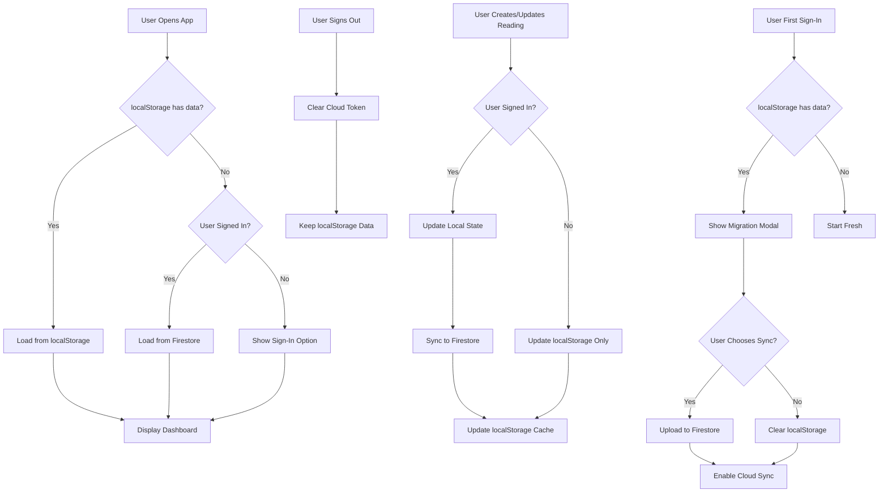

# TRD-005: Firebase Authentication & Cloud Sync Implementation

**Status**: ✔️ Completed  
**Priority**: Medium  
**Related PRD**: [PRD-005: Firebase Authentication & Cloud Sync](../prd/PRD-005-firebase-auth.md)  
**Created**: January 5, 2026  
**Last Updated**: February 20, 2026  
**Implemented By**: Development Team

---

## Overview

This TRD defines the technical implementation for optional Google authentication via Firebase to enable cross-device syncing of readings and settings. The implementation maintains offline-first functionality and allows users to continue using the app anonymously with localStorage as the default mode.

---

## Related PRD

- [PRD-005: Firebase Authentication & Cloud Sync](../prd/PRD-005-firebase-auth.md)

---

## Technical Architecture

### System Flow



### Component Architecture

```
types/index.ts (UPDATED)
    ├── User type
    ├── SyncStatus type
    └── Updated Settings with cloudSettings

lib/
    ├── firebase/
    │   ├── config.ts (Firebase configuration)
    │   ├── auth.ts (Authentication functions)
    │   ├── firestore.ts (Firestore operations)
    │   └── sync.ts (Sync logic)
    └── hooks/
        ├── useAuth.ts (NEW - Authentication state)
        └── useCloudSync.ts (NEW - Sync management)

components/
    ├── Header.tsx (UPDATED - Add Sign-In button)
    ├── LoginModal.tsx (NEW - Google sign-in)
    └── MigrationModal.tsx (NEW - localStorage migration)

app/
    └── layout.tsx (UPDATED - Initialize Firebase, auth listeners)
```

---

## Data Models

### Updated User Type

```typescript
// types/index.ts
export type User = {
  uid: string;
  email: string;
  displayName: string | null;
  photoURL: string | null;
  createdAt: timestamp;
  lastSeen: timestamp;
};

export type SyncStatus = {
  isSignedIn: boolean;
  isSyncing: boolean;
  lastSyncAt: timestamp | null;
  syncError: string | null;
  isOffline: boolean;
};

export type Reading = {
  id: string;
  title: string;
  content: string;
  tags?: string[];
  createdAt: timestamp;
  updatedAt: timestamp;
  isCompleted: boolean;
  // Cloud sync fields
  syncedAt?: timestamp;
  deletedAt?: timestamp; // For soft deletes
};

export type Settings = {
  theme: 'light' | 'dark' | 'detox' | 'high-contrast';
  fontSize: 'sm' | 'md' | 'lg';
  lineHeight: 'normal' | 'relaxed' | 'loose';
  accessibility: AccessibilitySettings;
  // Cloud sync fields
  syncedAt?: timestamp;
};
```

### Firestore Schema

```typescript
// users/{uid}/
// ├── profile/
// │   ├── email: string
// │   ├── displayName: string
// │   ├── photoURL: string
// │   ├── createdAt: timestamp
// │   └── lastSeen: timestamp
// │
// ├── readings/{readingId}/
// │   ├── id: string
// │   ├── title: string
// │   ├── content: string
// │   ├── tags: array
// │   ├── createdAt: timestamp
// │   ├── updatedAt: timestamp
// │   ├── isCompleted: boolean
// │   └── deletedAt: timestamp (nullable)
// │
// └── settings/
//     ├── theme: string
//     ├── fontSize: string
//     ├── lineHeight: string
//     ├── accessibility: map
//     └── updatedAt: timestamp
```

### localStorage Schema (Updated)

```typescript
{
  "readings": Reading[],
  "settings": Settings,
  "completedReadings": string[],
  "dashboardTab": "active" | "completed",
  "exampleDismissed": "true" | undefined,
  "syncStatus": {
    "isSignedIn": boolean,
    "isSyncing": boolean,
    "lastSyncAt": timestamp | null,
    "syncError": string | null,
    "isOffline": boolean
  },
  "user": User | null
}
```

---

## Implementation Details

### 1. Firebase Setup

**File**: [lib/firebase/config.ts](../../../lib/firebase/config.ts) (NEW)

```typescript
import { initializeApp } from 'firebase/app';
import { getAuth } from 'firebase/auth';
import { getFirestore, enableIndexedDbPersistence } from 'firebase/firestore';

const firebaseConfig = {
  apiKey: process.env.NEXT_PUBLIC_FIREBASE_API_KEY,
  authDomain: process.env.NEXT_PUBLIC_FIREBASE_AUTH_DOMAIN,
  projectId: process.env.NEXT_PUBLIC_FIREBASE_PROJECT_ID,
  storageBucket: process.env.NEXT_PUBLIC_FIREBASE_STORAGE_BUCKET,
  messagingSenderId: process.env.NEXT_PUBLIC_FIREBASE_MESSAGING_SENDER_ID,
  appId: process.env.NEXT_PUBLIC_FIREBASE_APP_ID,
};

export const app = initializeApp(firebaseConfig);
export const auth = getAuth(app);
export const db = getFirestore(app);

// Enable offline persistence
enableIndexedDbPersistence(db).catch((err) => {
  if (err.code === 'failed-precondition') {
    console.warn('Multiple tabs open, persistence only on one tab');
  } else if (err.code === 'unimplemented') {
    console.warn('Browser does not support offline persistence');
  }
});
```

### 2. Authentication Functions

**File**: [lib/firebase/auth.ts](../../../lib/firebase/auth.ts) (NEW)

```typescript
import { 
  signInWithPopup, 
  GoogleAuthProvider,
  signOut,
  onAuthStateChanged,
  User as FirebaseUser
} from 'firebase/auth';
import { auth } from './config';

const googleProvider = new GoogleAuthProvider();

export const signInWithGoogle = async () => {
  try {
    const result = await signInWithPopup(auth, googleProvider);
    return result.user;
  } catch (error) {
    console.error('Sign-in error:', error);
    throw error;
  }
};

export const signOutUser = async () => {
  try {
    await signOut(auth);
  } catch (error) {
    console.error('Sign-out error:', error);
    throw error;
  }
};

export const onAuthChange = (callback: (user: FirebaseUser | null) => void) => {
  return onAuthStateChanged(auth, callback);
};
```

### 3. Firestore Operations

**File**: [lib/firebase/firestore.ts](../../../lib/firebase/firestore.ts) (NEW)

```typescript
import {
  doc,
  setDoc,
  getDoc,
  collection,
  query,
  where,
  getDocs,
  updateDoc,
  deleteDoc,
  serverTimestamp,
  onSnapshot,
  writeBatch,
} from 'firebase/firestore';
import { db } from './config';
import { Reading, Settings, User } from '@/types';

// User Profile
export const createUserProfile = async (uid: string, userData: Partial<User>) => {
  const userRef = doc(db, 'users', uid, 'profile', 'info');
  await setDoc(userRef, {
    ...userData,
    createdAt: serverTimestamp(),
    lastSeen: serverTimestamp(),
  });
};

export const getUserProfile = async (uid: string) => {
  const userRef = doc(db, 'users', uid, 'profile', 'info');
  const docSnap = await getDoc(userRef);
  return docSnap.data();
};

// Readings CRUD
export const createReading = async (uid: string, reading: Reading) => {
  const readingRef = doc(db, 'users', uid, 'readings', reading.id);
  await setDoc(readingRef, {
    ...reading,
    createdAt: serverTimestamp(),
    updatedAt: serverTimestamp(),
    syncedAt: serverTimestamp(),
  });
};

export const updateReading = async (uid: string, reading: Reading) => {
  const readingRef = doc(db, 'users', uid, 'readings', reading.id);
  await updateDoc(readingRef, {
    ...reading,
    updatedAt: serverTimestamp(),
    syncedAt: serverTimestamp(),
  });
};

export const deleteReading = async (uid: string, readingId: string) => {
  const readingRef = doc(db, 'users', uid, 'readings', readingId);
  await updateDoc(readingRef, {
    deletedAt: serverTimestamp(),
  });
};

export const getAllReadings = async (uid: string) => {
  const readingsRef = collection(db, 'users', uid, 'readings');
  const q = query(readingsRef, where('deletedAt', '==', null));
  const querySnapshot = await getDocs(q);
  return querySnapshot.docs.map(doc => doc.data() as Reading);
};

// Settings
export const updateSettings = async (uid: string, settings: Settings) => {
  const settingsRef = doc(db, 'users', uid, 'settings', 'preferences');
  await setDoc(settingsRef, {
    ...settings,
    updatedAt: serverTimestamp(),
    syncedAt: serverTimestamp(),
  }, { merge: true });
};

export const getSettings = async (uid: string) => {
  const settingsRef = doc(db, 'users', uid, 'settings', 'preferences');
  const docSnap = await getDoc(settingsRef);
  return docSnap.data() as Settings | undefined;
};

// Real-time listeners
export const subscribeToReadings = (uid: string, callback: (readings: Reading[]) => void) => {
  const readingsRef = collection(db, 'users', uid, 'readings');
  const q = query(readingsRef, where('deletedAt', '==', null));
  
  return onSnapshot(q, (snapshot) => {
    const readings = snapshot.docs.map(doc => doc.data() as Reading);
    callback(readings);
  });
};

export const subscribeToSettings = (uid: string, callback: (settings: Settings) => void) => {
  const settingsRef = doc(db, 'users', uid, 'settings', 'preferences');
  
  return onSnapshot(settingsRef, (doc) => {
    if (doc.exists()) {
      callback(doc.data() as Settings);
    }
  });
};
```

### 4. Sync Logic

**File**: [lib/firebase/sync.ts](../../../lib/firebase/sync.ts) (NEW)

```typescript
import { Reading, Settings } from '@/types';
import { 
  getAllReadings, 
  createReading, 
  getSettings, 
  updateSettings 
} from './firestore';

// Migrate localStorage data to Firestore
export const migrateLocalStorageToFirestore = async (
  uid: string,
  localReadings: Reading[],
  localSettings: Settings
) => {
  try {
    // Upload all readings
    const uploadPromises = localReadings.map(reading => 
      createReading(uid, {
        ...reading,
        createdAt: reading.createdAt || new Date(),
        updatedAt: reading.updatedAt || new Date(),
        isCompleted: reading.isCompleted || false,
      })
    );
    
    await Promise.all(uploadPromises);

    // Upload settings
    await updateSettings(uid, localSettings);

    return { success: true };
  } catch (error) {
    console.error('Migration error:', error);
    throw error;
  }
};

// Sync offline changes to cloud
export const syncOfflineChanges = async (
  uid: string,
  localReadings: Reading[],
  localSettings: Settings,
  lastSyncTime: number
) => {
  try {
    const cloudReadings = await getAllReadings(uid);
    const cloudSettings = await getSettings(uid);

    // Find new/updated readings
    for (const reading of localReadings) {
      const cloudReading = cloudReadings.find(r => r.id === reading.id);
      
      if (!cloudReading) {
        // New reading
        await createReading(uid, reading);
      } else if (reading.updatedAt > cloudReading.updatedAt) {
        // Updated reading
        await updateReading(uid, reading);
      }
    }

    // Sync settings if changed
    if (localSettings.syncedAt && localSettings.syncedAt > lastSyncTime) {
      await updateSettings(uid, localSettings);
    }

    return { success: true, syncedAt: Date.now() };
  } catch (error) {
    console.error('Sync error:', error);
    throw error;
  }
};

// Detect and resolve conflicts (last-write-wins)
export const resolveConflict = (
  localVersion: Reading,
  cloudVersion: Reading
): Reading => {
  // Use the version with the latest updatedAt
  return localVersion.updatedAt > cloudVersion.updatedAt 
    ? localVersion 
    : cloudVersion;
};
```

### 5. Custom Hooks

**File**: [hooks/useAuth.ts](../../../hooks/useAuth.ts) (NEW)

```typescript
import { useEffect, useState } from 'react';
import { User as FirebaseUser } from 'firebase/auth';
import { onAuthChange, signInWithGoogle, signOutUser } from '@/lib/firebase/auth';

export const useAuth = () => {
  const [user, setUser] = useState<FirebaseUser | null>(null);
  const [loading, setLoading] = useState(true);
  const [error, setError] = useState<string | null>(null);

  useEffect(() => {
    const unsubscribe = onAuthChange((firebaseUser) => {
      setUser(firebaseUser);
      setLoading(false);
    });

    return unsubscribe;
  }, []);

  const login = async () => {
    try {
      setError(null);
      await signInWithGoogle();
    } catch (err) {
      setError(err instanceof Error ? err.message : 'Sign-in failed');
    }
  };

  const logout = async () => {
    try {
      setError(null);
      await signOutUser();
    } catch (err) {
      setError(err instanceof Error ? err.message : 'Sign-out failed');
    }
  };

  return { user, loading, error, login, logout };
};
```

**File**: [hooks/useCloudSync.ts](../../../hooks/useCloudSync.ts) (NEW)

```typescript
import { useEffect, useState } from 'react';
import { useAuth } from './useAuth';
import { 
  subscribeToReadings, 
  subscribeToSettings,
  syncOfflineChanges 
} from '@/lib/firebase/sync';
import { Reading, Settings, SyncStatus } from '@/types';

export const useCloudSync = (localReadings: Reading[], localSettings: Settings) => {
  const { user } = useAuth();
  const [syncStatus, setSyncStatus] = useState<SyncStatus>({
    isSignedIn: !!user,
    isSyncing: false,
    lastSyncAt: null,
    syncError: null,
    isOffline: !navigator.onLine,
  });

  // Listen for online/offline changes
  useEffect(() => {
    const handleOnline = () => setSyncStatus(prev => ({ ...prev, isOffline: false }));
    const handleOffline = () => setSyncStatus(prev => ({ ...prev, isOffline: true }));

    window.addEventListener('online', handleOnline);
    window.addEventListener('offline', handleOffline);

    return () => {
      window.removeEventListener('online', handleOnline);
      window.removeEventListener('offline', handleOffline);
    };
  }, []);

  // Subscribe to cloud changes when signed in
  useEffect(() => {
    if (!user) return;

    const unsubscribeReadings = subscribeToReadings(user.uid, (cloudReadings) => {
      // Merge with local readings
      // TODO: Implement merge logic
    });

    const unsubscribeSettings = subscribeToSettings(user.uid, (cloudSettings) => {
      // Update local settings
      // TODO: Implement update logic
    });

    return () => {
      unsubscribeReadings();
      unsubscribeSettings();
    };
  }, [user]);

  // Sync offline changes when back online
  useEffect(() => {
    if (syncStatus.isOffline || !user) return;

    const syncChanges = async () => {
      setSyncStatus(prev => ({ ...prev, isSyncing: true }));
      try {
        await syncOfflineChanges(
          user.uid,
          localReadings,
          localSettings,
          syncStatus.lastSyncAt || 0
        );
        setSyncStatus(prev => ({
          ...prev,
          isSyncing: false,
          lastSyncAt: Date.now(),
          syncError: null,
        }));
      } catch (err) {
        setSyncStatus(prev => ({
          ...prev,
          isSyncing: false,
          syncError: err instanceof Error ? err.message : 'Sync failed',
        }));
      }
    };

    syncChanges();
  }, [syncStatus.isOffline, user]);

  return syncStatus;
};
```

### 6. Update Header Component

**File**: [components/Header.tsx](../../../components/Header.tsx) (UPDATED)

```typescript
import { useAuth } from '@/hooks/useAuth';

export const Header = () => {
  const { user, login, logout } = useAuth();
  const [showLoginModal, setShowLoginModal] = useState(false);

  return (
    <header>
      <h1>tellingQuote</h1>
      <nav>
        {user ? (
          <div className="flex items-center gap-4">
            <span>{user.displayName || user.email}</span>
            <button onClick={logout}>Sign Out</button>
          </div>
        ) : (
          <button onClick={() => setShowLoginModal(true)}>Sign In</button>
        )}
      </nav>
      {showLoginModal && (
        <LoginModal 
          onClose={() => setShowLoginModal(false)}
          onLogin={login}
        />
      )}
    </header>
  );
};
```

### 7. Migration Modal Component

**File**: [components/MigrationModal.tsx](../../../components/MigrationModal.tsx) (NEW)

```typescript
import { useState } from 'react';

export const MigrationModal = ({ 
  readingsCount, 
  onMigrate, 
  onSkip,
  isLoading 
}: {
  readingsCount: number;
  onMigrate: () => Promise<void>;
  onSkip: () => void;
  isLoading: boolean;
}) => {
  const [error, setError] = useState<string | null>(null);

  const handleMigrate = async () => {
    try {
      setError(null);
      await onMigrate();
    } catch (err) {
      setError(err instanceof Error ? err.message : 'Migration failed');
    }
  };

  return (
    <div role="dialog" aria-modal="true" aria-labelledby="migration-title">
      <h2 id="migration-title">Sync Your Readings?</h2>
      <p>
        We found {readingsCount} reading{readingsCount !== 1 ? 's' : ''} on this device.
        Would you like to sync them to your cloud account?
      </p>
      {error && <div className="error">{error}</div>}
      <div className="flex gap-2">
        <button 
          onClick={handleMigrate}
          disabled={isLoading}
          className="primary"
        >
          {isLoading ? 'Syncing...' : 'Yes, Sync'}
        </button>
        <button 
          onClick={onSkip}
          disabled={isLoading}
          className="secondary"
        >
          Start Fresh
        </button>
      </div>
    </div>
  );
};
```

### 8. Environment Variables

**File**: [.env.local](../../../.env.local) (NEW)

```bash
NEXT_PUBLIC_FIREBASE_API_KEY=xxx
NEXT_PUBLIC_FIREBASE_AUTH_DOMAIN=xxx
NEXT_PUBLIC_FIREBASE_PROJECT_ID=xxx
NEXT_PUBLIC_FIREBASE_STORAGE_BUCKET=xxx
NEXT_PUBLIC_FIREBASE_MESSAGING_SENDER_ID=xxx
NEXT_PUBLIC_FIREBASE_APP_ID=xxx
```

---

## Firestore Security Rules

**File**: `firestore.rules` (Deploy to Firebase)

```javascript
rules_version = '2';
service cloud.firestore {
  match /databases/{database}/documents {
    // Users can only access their own data
    match /users/{uid} {
      allow read, write: if request.auth != null && request.auth.uid == uid;
      
      match /profile/info {
        allow read: if request.auth != null && request.auth.uid == uid;
        allow write: if request.auth != null && request.auth.uid == uid;
      }
      
      match /readings/{document=**} {
        allow read: if request.auth != null && request.auth.uid == uid;
        allow write: if request.auth != null && request.auth.uid == uid;
      }
      
      match /settings/preferences {
        allow read: if request.auth != null && request.auth.uid == uid;
        allow write: if request.auth != null && request.auth.uid == uid;
      }
    }
  }
}
```

---

## Testing Strategy

### Unit Tests

- Auth functions (sign-in, sign-out)
- Firestore CRUD operations
- Sync logic and conflict resolution
- Local storage persistence

### Integration Tests

- Full authentication flow
- Migration from localStorage to Firestore
- Real-time sync listeners
- Offline/online transitions
- Cross-tab communication

### E2E Tests

- Sign in → Create reading → Sign out → Sign in → Verify data
- Create reading offline → Go online → Verify sync
- Create reading on desktop → Switch to mobile → Verify sync

---

## Performance Considerations

- Firestore offline persistence (IndexedDB)
- Debounce sync operations
- Batch writes where possible
- Progressive sync (don't block UI)

---

## Security Considerations

- Firestore rules restrict to authenticated user data
- Google OAuth handled by Firebase (secure)
- No sensitive data in localStorage
- API keys are public (NEXT_PUBLIC_) but safe in Firebase rules

---

## Migration & Backward Compatibility

- App works offline without auth
- Existing localStorage data is preserved
- Optional sign-in doesn't require migration
- Users can opt-out and continue with localStorage only

---

## Future Enhancements

- Conflict resolution UI for simultaneous edits
- Selective sync (choose readings to sync)
- Export/import functionality
- Sharing readings with other users
- Collaborative editing
- Read receipts and presence indicators
